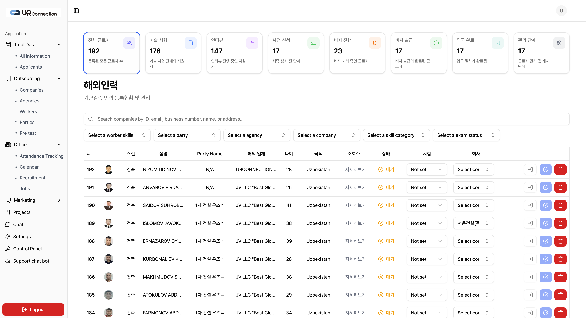
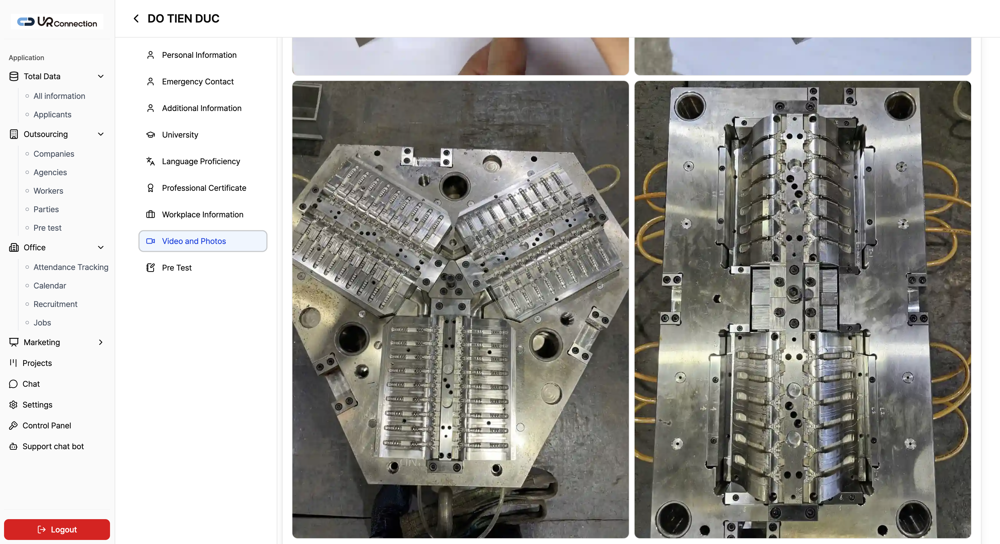
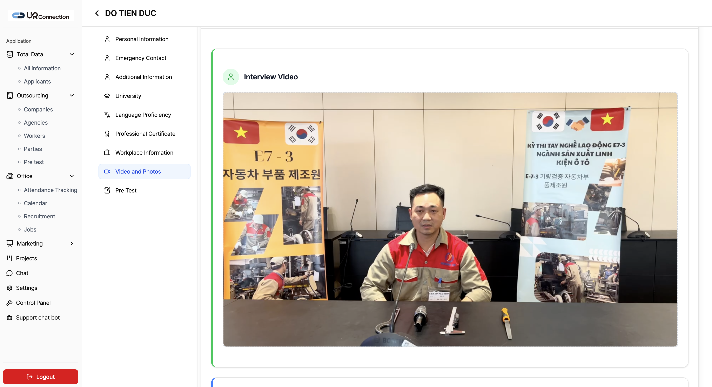
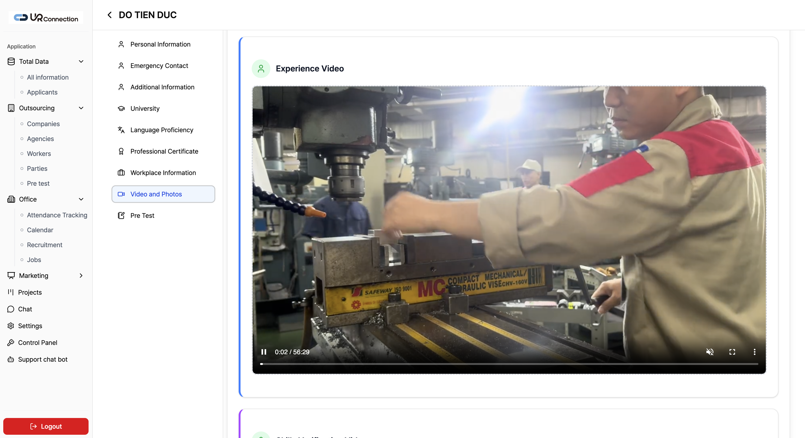
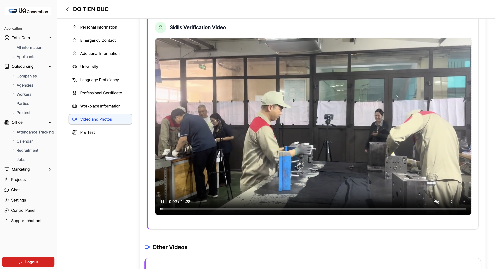
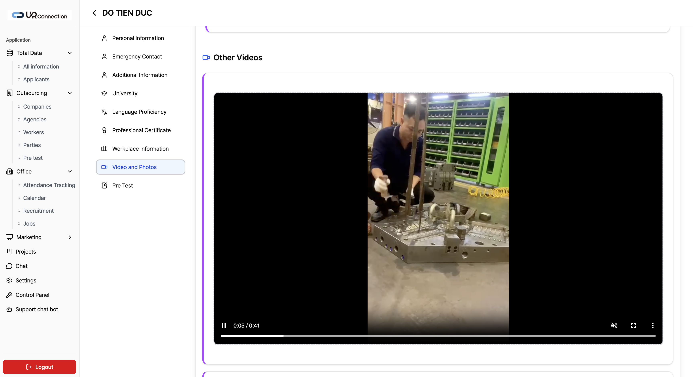
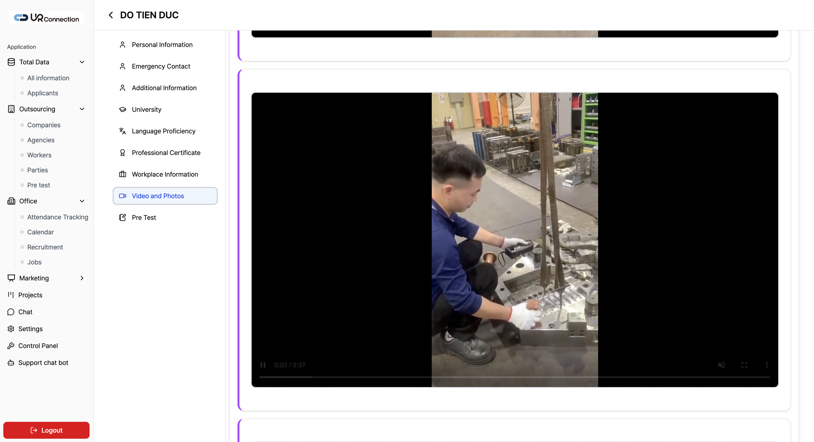
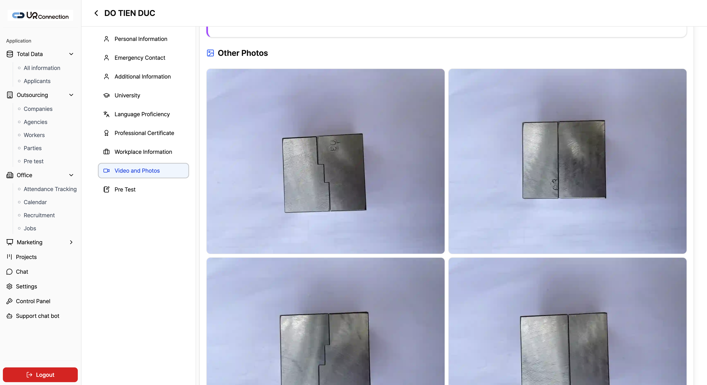

# 화면 목록 및 캡처

원본 제공 자료의 PNG를 화면 단위로 정리했다.  
이미지 경로: [images/](./images/)

| No | 파일 | 화면명 | 유형 | 요약 |
|----|------|--------|------|------|
| 01 | [01-인력등록현황-및-관리.png](./images/01-인력등록현황-및-관리.png) | 해외인력 등록 현황 및 관리 | 목록 | KPI 8카드 + 검색/필터 + 인력 테이블 |
| 02 | [02-기량검증-화면-01.png](./images/02-기량검증-화면-01.png) | 인력 상세 · Video and Photos (사진) | 상세 | DO TIEN DUC / 부품·현장 사진 그리드 |
| 03 | [03-기량검증-화면-02.png](./images/03-기량검증-화면-02.png) | 인력 상세 · Interview Video | 상세 | 인터뷰 영상 플레이어 |
| 04 | [04-기량검증-화면-03.png](./images/04-기량검증-화면-03.png) | 인력 상세 · Experience Video | 상세 | 실무 경험 영상 (설비 작업) |
| 05 | [05-기량검증-화면-04.png](./images/05-기량검증-화면-04.png) | 인력 상세 · Skills Verification Video | 상세 | 기량 검증 영상 + Other Videos |
| 06 | [06-기량검증-화면-05.png](./images/06-기량검증-화면-05.png) | 인력 상세 · Other Videos (1) | 상세 | 추가 작업 영상 |
| 07 | [07-기량검증-화면-06.png](./images/07-기량검증-화면-06.png) | 인력 상세 · Other Videos (2) | 상세 | 추가 작업 영상 |
| 08 | [08-기량검증-화면-07.png](./images/08-기량검증-화면-07.png) | 인력 상세 · Other Photos | 상세 | 기타 사진 2×2 그리드 |

> 참고: 원본 폴더의 기량검증 영상.mp4는 용량이 커서 저장소에는 포함하지 않았다. 필요 시 OneDrive 원본 경로를 사용한다.

---

## 01. 해외인력 등록 현황 및 관리

### 구성

1. **사이드바** — UR Connection 로고, Total Data / Outsourcing / Office 등
2. **KPI 카드 8개** — 파이프라인 단계별 인원
3. **타이틀** — 해외인력 / 기량검증 인력 등록 현황 및 관리
4. **검색바** — ID, email, 사업자번호, 이름, 주소 등
5. **필터 6종** — worker skills, party, agency, company, skill category, exam status
6. **테이블 컬럼** — #, 사진, 스킬, 성명, Party, 해외업체, 나이, 국적, 조회, 상태, 시험, 회사, Actions

### 주요 UI 요소

- Status: 대기 + 경고 아이콘
- Exam / Company: 인라인 셀렉트
- Actions: 이관 · 승인 · 삭제

---

## 02. Video and Photos — 사진 그리드

- 상세 헤더: < DO TIEN DUC
- 서브내비에서 **Video and Photos** 활성 (블루 하이라이트)
- 우측: 산업 부품/현장 사진 그리드

---

## 03. Interview Video

- 섹션 타이틀: Interview Video
- 임베드 비디오 플레이어 (면접·기술평가 맥락 배너 포함 장면)

---

## 04. Experience Video

- 섹션 타이틀: Experience Video
- 설비·바이스 등 실무 작업 장면, 장시간 영상 컨트롤

---

## 05. Skills Verification Video

- 섹션 타이틀: Skills Verification Video
- 하단에 **Other Videos** 영역으로 이어지는 스크롤 구조

---

## 06–07. Other Videos

- Other Videos 목록형 재생
- 공장/금형·부품 작업 장면

---

## 08. Other Photos

- 섹션 타이틀: Other Photos
- 2×2 사진 그리드 (금속 부품 근접 촬영)

---

## 화면 흐름

`mermaid
flowchart LR
  A[로그인] --> B[해외인력 목록]
  B --> C[인력 상세]
  C --> D[프로필 섹션들]
  C --> E[Video and Photos]
  E --> E1[Photos]
  E --> E2[Interview Video]
  E --> E3[Experience Video]
  E --> E4[Skills Verification]
  E --> E5[Other Videos / Photos]
  C --> F[Pre Test]
`
